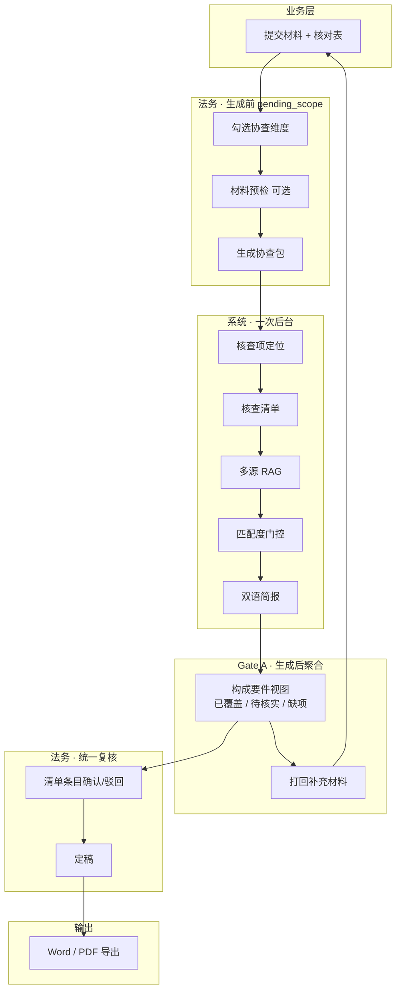

# Vela 协查流程 v2（一遍生成 + 统一复核）

> 对应实现：`generate-investigation` · `InvestigationAdequacyPanel` · 统一复核页  
> 文件：`docs/vela_investigation_workflow_v2.xmind`

---

## 一图读懂

---

## 步骤对照表

| 产品步骤 | 名称 | 谁操作 | MVP 页面/接口 |
|---------|------|--------|---------------|
| 0 | 业务提交 | 业务 | 材料提交 |
| 1 | 范围确认 | 法务勾维 | `LegalMaterialGatePanel` |
| — | **生成协查包** | 法务一键 | `POST /generate-investigation` |
| 2 | 核查项定位 | 系统 | 在法务选定维度内触发核查条目；含于生成协查包 |
| 3 | 多源 RAG | 系统 | 含于生成协查包 |
| 4 | 跨语种 + 匹配度 | 系统 | 含于生成协查包 · 阈值 70 |
| 5 | 生成简报 | 系统 | 含于生成协查包 |
| Gate A | 构成要件判断 | 法务看聚合视图 | `InvestigationAdequacyPanel` |
| 6 | 法务复核 | 法务 | `ReviewView` 清单区 |
| 7 | 导出归档 | 法务 | Word / PDF |

---

## Gate A（新定义）

**不再是**：生成前扫字段 → 齐了才「确认继续」锁死。

**现在是**：

1. **生成前**：勾维 + 材料预检（弱信号，不阻断）
2. **生成后**：用 **条目 RAG + 匹配度 + 材料预检** 聚合构成要件
3. **不齐**：未定稿前 **随时打回**（含已生成协查包，草稿归档）
4. **齐了**：继续在同页做清单法律复核

---

## 法务实际操作（3 步）

1. **勾维 → 生成协查包**
2. **看 Gate A 聚合 + 逐条复核清单**（同一页；材料问题打回，法律问题驳回）
3. **定稿 → 导出**

---

## 与旧流程差异

| 旧 | 新 |
|----|-----|
| Gate A 阻断确认 | 不阻断，先生成全量协查包 |
| 构成要件 = 固定字段扫描 | 构成要件 = RAG/匹配度聚合 |
| 确认后难打回材料 | 未定稿前可随时打回 |
| 补材料后整包重跑 | **增量更新**：仅变更字段/打回要件关联条目重算 RAG 与 Gate A，其余沿用 |
| Step 2–5 在确认后出现 | Step 2–5 在「生成协查包」内一次完成 |

---

## 数据源

- 法规语料：LexML、STF、STJ、Jusbrasil
- 规则包：`brazil_new_energy.json` · `dimension_elements`
- 交付物：核查清单、双语简报、协查底稿
