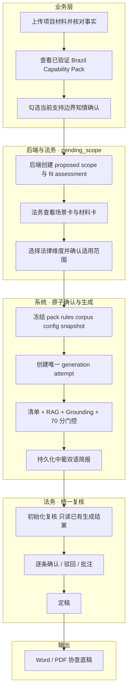

# Vela 协查流程 v2（显式确认 + 冻结快照）

> 当前唯一受控试点流程对应 `submit-materials`、`confirm-scope`、generation attempt、统一复核与导出。
> 旧 `docs/vela_investigation_workflow_v2.xmind` 仅保留在工作区作历史参考，不随发布 ZIP 分发；以下 Markdown 与 `content.json` 为当前权威流程说明。

---

## 一图读懂

```mermaid
flowchart TB
  subgraph biz [业务层]
    A[上传项目材料并核对事实]
    B[查看已验证 Brazil Capability Pack]
    C[勾选当前支持边界知情确认]
  end

  subgraph scope [后端与法务 · pending_scope]
    D[后端创建 proposed scope 与 fit assessment]
    E[法务查看场景卡与材料卡]
    F[选择法律维度并确认适用范围]
  end

  subgraph generate [系统 · 原子确认与生成]
    G[冻结 pack rules corpus config snapshot]
    H[创建唯一 generation attempt]
    I[清单 + RAG + Grounding + 70 分门控]
    J[持久化中葡双语简报]
  end

  subgraph review [法务 · 统一复核]
    K[初始化复核 只读已有生成结果]
    L[逐条确认 / 驳回 / 批注]
    M[定稿]
  end

  subgraph out [输出]
    N[Word / PDF 协查底稿]
  end

  A --> B --> C --> D
  D --> E --> F --> G --> H --> I --> J
  J --> K --> L --> M --> N
```

---

## 步骤对照表

| 顺序 | 阶段 | 谁操作 | 正式页面 / 接口 |
|------|------|--------|-----------------|
| 1 | 上传、核对项目事实 | 业务 | 材料提交页；可先调用 `POST /scenarios/extract-document` |
| 2 | 查看受控试点工程边界并知情确认 | 业务 | Capability Pack 卡片；`POST /scenarios/submit-materials` |
| 3 | 创建 proposed scope | 后端 | 状态 `pending_scope`；此时不得生成清单、RAG 或简报 |
| 4 | 查看场景卡、材料卡并选择维度 | 法务 | `LegalMaterialGatePanel` |
| 5 | **确认范围并生成** | 法务 | `POST /scenarios/{id}/confirm-scope` |
| 6 | 冻结配置并生成 | 系统 | 先冻结 Capability Pack、规则、语料及完整 generation config，再创建唯一 attempt |
| 7 | 读取结果 | 业务 / 法务 | 清单、RAG、brief 均读取已持久化结果；读页面不触发生成 |
| 8 | 法务复核与定稿 | 法务 | `POST /scenarios/{id}/review/init` → 逐条复核 → `review/finalize` |
| 9 | 导出归档 | 法务 | Word / PDF 协查底稿 |

生成失败只能调用 `POST /scenarios/{id}/retry-generation`，并严格沿用同一份 snapshot。旧 `generate-investigation` 仅为 deprecated 兼容 URL，不是正式文档或演示入口。

---

## Capability Pack 边界

当前 Registry 只有一个受控试点能力包：

- `brazil_new_energy_greenfield`
- 展示名称：巴西 · 新能源制造 · 绿地设厂
- 绑定规则制品：`brazil_new_energy` v2.9
- 绑定语料制品：`brazil_legal_corpus` v1.9

测试 fixture 不代表国家、行业或法律能力，也不进入生产 Registry 或发布制品。

---

## Gate A 与生成边界

1. **生成前**：材料预检是法务判断范围的参考，不得代替法务确认。
2. **确认时**：snapshot 固定 pack、规则、语料、维度、议题、阈值、Top-K 与输出配置。
3. **生成后**：用条目 RAG、Grounding、匹配度和材料预检聚合构成要件。
4. **读页面**：Checklist、Brief 与 `review/init` 只能消费已有成功结果，不得隐式生成。
5. **补充材料**：法务退回后，业务在同一项目补充并重新进入 `pending_scope`，再次由法务确认新的 proposed scope。

---

## 法律责任边界

系统输出是供企业法务复核的协查底稿。AI 可辅助事实抽取、核查项定位和双语表述，但不能替代律师判断；所有对外交付均须经法务逐条复核和定稿，平台输出不构成正式法律意见。

---

## 数据源

- Capability Pack：`backend/app/capability_packs/brazil_new_energy_greenfield/manifest.json`
- 规则制品：`backend/app/rules/brazil_new_energy.json`
- 正式语料：`backend/app/data/brazil_legal_corpus.json`
- 交付物：专项核查清单、法源绑定、中葡双语简报、经复核的协查底稿
